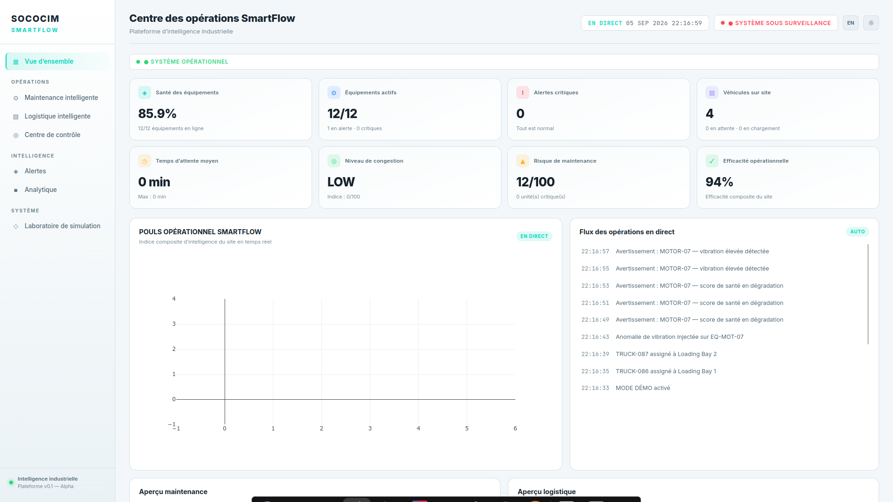

# SOCOCIM SmartFlow

## Plateforme d'intelligence industrielle

SOCOCIM SmartFlow est un démonstrateur logiciel de supervision industrielle conçu pour illustrer deux capacités complémentaires :

- **Smart Maintenance** : surveiller l'état des équipements, détecter des anomalies et proposer des actions de maintenance ;
- **Smart Logistics** : suivre une flotte simulée, analyser les files d'attente et détecter les congestions.

L'application rassemble les données simulées dans un moteur d'exécution commun afin de montrer la chaîne complète :

```text
Simulation
    -> Etat des équipements et des véhicules
    -> Détection d'anomalies et de congestions
    -> Alertes et recommandations
    -> Supervision opérationnelle
```

Cette version est une **Alpha locale destinée à la démonstration**. Elle ne remplace pas encore un système industriel connecté ou certifié.

## Fonctionnalités

### Vue d'ensemble

La page **Overview** présente l'état global du site :

- santé des équipements ;
- équipements actifs et critiques ;
- alertes critiques ;
- véhicules présents sur site ;
- temps d'attente moyen ;
- niveau de congestion ;
- risque de maintenance ;
- efficacité opérationnelle ;
- radar `SmartFlow Operational Pulse` ;
- flux d'événements en temps réel.

#### Captures d'écran

- `overview-fr.png` : vue principale en français, utilisée pour présenter l'état global du site dès l'ouverture ;


- `overview-en.png` : même écran après bascule manuelle en anglais ;
- `overview-live-feed-fr.png` : détail du flux d'opérations et des événements traduits.

Les captures correspondantes seront placées dans [`docs/screenshots/`](docs/screenshots/). Elles doivent montrer la relation entre les KPI, le radar opérationnel et le flux d'événements.

### Smart Maintenance

La page **Smart Maintenance** permet de :

- consulter la flotte d'équipements industriels simulés ;
- suivre la température, les vibrations et la santé des équipements ;
- sélectionner un équipement pour afficher sa vue détaillée ;
- consulter les tendances de température et de vibration ;
- suivre l'évolution de la santé et du risque ;
- générer des recommandations selon les seuils métiers ;
- déclencher des anomalies depuis le laboratoire de simulation.

Les équipements sont représentés par des identifiants industriels simulés tels que `MOTOR-07`, `CRUSHER-01`, `CONVEYOR-02` ou `MIXER-03`.

#### Captures d'écran

- `maintenance-fr.png` : liste des équipements, statuts, scores de santé et mesures courantes ;
- `maintenance-detail-fr.png` : vue détaillée d'un équipement sélectionné ;
- `maintenance-anomaly-fr.png` : évolution visible après injection d'une anomalie et apparition de la recommandation.

Chaque capture doit être accompagnée d'une courte description de l'action visible : surveillance, sélection, anomalie, évolution du score ou recommandation.

### Smart Logistics

La page **Smart Logistics** permet de :

- suivre les véhicules simulés sur une carte Leaflet/OpenStreetMap ;
- visualiser les points du site : portails, contrôle de sécurité, pont-bascule, files et baies de chargement ;
- suivre les statuts des véhicules ;
- consulter les files d'attente et les temps d'attente ;
- calculer un indice de congestion ;
- filtrer la flotte ;
- suivre le débit et l'utilisation des baies ;
- générer des recommandations logistiques.

#### Captures d'écran

- `logistics-fr.png` : carte du site, véhicules simulés et points logistiques ;
- `logistics-queue-fr.png` : file d'attente, temps d'attente et indice de congestion ;
- `logistics-table-fr.png` : tableau filtrable des véhicules et de leurs statuts.

Ces captures doivent expliquer ce que l'opérateur observe : position des véhicules, état de la circulation, file à traiter et action recommandée.

### Centre de contrôle

Le **Control Center** regroupe les informations importantes pour une supervision rapide :

- état global ;
- équipements critiques ;
- carte miniature ;
- congestion ;
- alertes et recommandations ;
- événements opérationnels.

#### Captures d'écran

- `control-center-fr.png` : écran consolidé de supervision ;
- `control-center-critical-fr.png` : équipements critiques, congestion et recommandations actives.

Cette section doit illustrer la décision opérationnelle : identifier rapidement le problème, sa gravité et la réponse proposée par SmartFlow.

### Centre des alertes

La page **Alert Center** propose :

- filtrage par gravité : information, avertissement ou critique ;
- filtrage par source : maintenance ou logistique ;
- statut `NEW`, `ACKNOWLEDGED` ou `RESOLVED` ;
- actions d'acquittement et de résolution ;
- message et recommandation traduits selon la langue active.

Les alertes sont conservées en mémoire pendant l'exécution de l'application.

#### Captures d'écran

- `alerts-fr.png` : liste des alertes avec filtres de gravité et de source ;
- `alerts-action-fr.png` : détail d'une alerte avec les actions d'acquittement et de résolution.

La description de chaque capture doit préciser la source, la sévérité, le statut et la recommandation affichés.

### Analytique

La page **Analytics** présente notamment :

- la distribution de la santé des équipements ;
- les anomalies par équipement ;
- le classement des risques de maintenance ;
- l'évolution de la congestion ;
- l'évolution des files ;
- l'utilisation des baies de chargement.

#### Captures d'écran

- `analytics-fr.png` : distribution de santé et risques de maintenance ;
- `analytics-logistics-fr.png` : évolution des files, congestion et utilisation des baies.

Ces vues servent à expliquer les tendances historiques simulées et ne représentent pas encore des données industrielles persistées.

### Laboratoire de simulation

La page **Simulation Lab** permet de déclencher manuellement des scénarios :

#### Maintenance

- fonctionnement normal ;
- température élevée ;
- vibration élevée ;
- panne critique ;
- capteur hors ligne ;
- restauration du système.

#### Logistique

- trafic normal ;
- afflux d'arrivées ;
- congestion au portail ;
- panne de baie de chargement ;
- file d'urgence ;
- restauration du trafic.

#### Commandes globales

- vitesse de simulation `1x`, `2x`, `5x` ou `10x` ;
- démarrage et arrêt du mode démo ;
- journal des événements simulés.

#### Captures d'écran

- `simulation-fr.png` : commandes de scénarios de maintenance et de logistique ;
- `simulation-demo-fr.png` : mode démo actif et journal des événements ;
- `simulation-language-fr.png` : contrôle manuel de la langue et conservation de la préférence.

Chaque capture doit indiquer le scénario déclenché et le résultat observable dans l'application.

## Captures d'écran du produit

Les captures d'écran sont regroupées dans [`docs/screenshots/`](docs/screenshots/). Le dossier contient également les consignes de nommage et d'organisation.

Pour ajouter une capture :

1. lancez l'application ;
2. placez-vous sur la section concernée ;
3. activez le scénario utile si nécessaire ;
4. réalisez la capture sans données sensibles ;
5. enregistrez l'image dans `docs/screenshots/` ;
6. ajoutez son nom et sa description dans la sous-section correspondante ci-dessus.

Une capture doit toujours répondre à trois questions :

- quelle section est montrée ?
- quelle action ou information importante est visible ?
- quelle valeur cette interface apporte-t-elle à l'opérateur ?

## Langue et thème

Le français est la langue par défaut de l'application.

- Le bouton de langue permet de basculer manuellement entre le français et l'anglais.
- La langue est conservée dans le stockage local du navigateur.
- Le thème clair et le thème sombre sont également disponibles depuis le topbar.
- Les titres, statuts, filtres, alertes, recommandations, événements et libellés dynamiques utilisent le catalogue i18n.

La logique de traduction se trouve principalement dans `utils/i18n.py` :

- `t()` traduit les libellés statiques ;
- `tt()` traduit les modèles contenant des paramètres ;
- `t_event()` traduit les événements stockés sous forme de clé et de paramètres.

## Architecture technique

L'Alpha est une application Python/Dash monolithique légère. Elle ne dépend pas d'un backend séparé ni d'une base de données.

```text
app.py
  |
  +-- Layout Dash et stores globaux
  |
  +-- callbacks/
  |     +-- navigation
  |     +-- overview
  |     +-- maintenance
  |     +-- logistics
  |     +-- control center
  |     +-- alerts
  |     +-- analytics
  |     +-- simulation
  |
  +-- pages/       Interfaces des écrans
  +-- components/  Composants réutilisables
  +-- services/    Agrégations et recommandations
  +-- simulation/  Moteurs de capteurs, flotte et scénarios
  +-- data/        Modèles et données initiales simulées
  +-- utils/       Constantes, calculs et traduction
```

### Moteur global

`simulation/engine.py` contient l'instance singleton `ENGINE`, source commune de vérité pour toutes les pages.

Le moteur conserve :

- les équipements ;
- les véhicules ;
- les alertes ;
- les événements ;
- l'historique des capteurs ;
- l'historique de congestion ;
- la vitesse de simulation ;
- l'état du mode démo.

Chaque page lit cet état partagé. Une donnée ne doit donc pas être recréée aléatoirement dans chaque écran.

### Services simulés

- `MockSensorService` simule les mesures et anomalies des équipements ;
- `MockFleetService` simule les déplacements et statuts des véhicules ;
- `MaintenanceService` agrège l'état de la flotte industrielle ;
- `LogisticsService` agrège les files, temps d'attente et congestions ;
- `RecommendationEngine` applique les règles de recommandation ;
- `AlertService` gère le cycle de vie des alertes en mémoire.

Ces services sont séparés de l'interface afin de pouvoir être remplacés ultérieurement par des sources réelles.

## Stack technique

- Python 3.11 ou supérieur ;
- Dash ;
- Dash Bootstrap Components ;
- Plotly ;
- dash-leaflet ;
- NumPy ;
- pandas, disponible pour les futurs traitements analytiques ;
- CSS personnalisé dans `assets/styles.css`.

La carte utilise OpenStreetMap et ne nécessite aucune clé Google Maps ou API payante.

## Installation

Depuis la racine du projet :

```bash
python3 -m venv .venv
source .venv/bin/activate
python -m pip install -r requirements.txt
```

Sous Windows, l'activation de l'environnement virtuel est :

```powershell
.venv\Scripts\activate
```

## Lancement

```bash
source .venv/bin/activate
python app.py
```

Puis ouvrir :

```text
http://127.0.0.1:8050
```

Si le port `8050` est déjà utilisé, lancer temporairement l'application sur un autre port :

```bash
python -c "import app; app.app.run(debug=False, host='127.0.0.1', port=8051)"
```

## Scénario de démonstration recommandé

1. Ouvrir l'application sur **Overview** et présenter l'état global.
2. Ouvrir **Smart Maintenance** et sélectionner `MOTOR-07`.
3. Dans **Simulation Lab**, déclencher une vibration élevée ou une panne critique.
4. Observer l'évolution du capteur, de la santé, du risque et des alertes.
5. Lire la recommandation générée par le moteur métier.
6. Ouvrir **Smart Logistics** et observer les véhicules sur la carte.
7. Déclencher **Arrival Rush** ou **Gate Congestion**.
8. Observer l'évolution de la file et de l'indice de congestion.
9. Ouvrir **Control Center** pour présenter la situation consolidée.
10. Utiliser **Alerts** pour acquitter ou résoudre les alertes.
11. Restaurer le système et le trafic depuis le laboratoire de simulation.

## Règles de simulation

### Santé des équipements

Les scores reposent sur les mesures simulées, les seuils du type d'équipement et l'historique récent. Les niveaux sont :

```text
90 - 100 : excellent
75 - 89  : sain
55 - 74  : avertissement
0  - 54  : critique
```

Les seuils de température et de vibration sont définis dans `utils/constants.py` et peuvent varier selon le type de machine.

### Congestion

L'indice de congestion tient compte de l'état de la flotte, de la file d'attente, des temps d'attente et de l'occupation des baies. Les niveaux sont :

```text
LOW
MODERATE
HIGH
CRITICAL
```

Les scénarios ne représentent pas une prédiction industrielle certifiée. Ils servent à démontrer le fonctionnement de la chaîne de supervision et de recommandation.

## Structure du projet

```text
SMART_SOCOCIM_FLOW/
├── app.py
├── requirements.txt
├── README.md
├── docs/
│   └── screenshots/
│       └── README.md
├── assets/
│   └── styles.css
├── callbacks/
│   ├── navigation_callbacks.py
│   ├── overview_callbacks.py
│   ├── maintenance_callbacks.py
│   ├── logistics_callbacks.py
│   ├── control_center_callbacks.py
│   ├── alerts_callbacks.py
│   ├── analytics_callbacks.py
│   └── simulation_callbacks.py
├── components/
│   ├── navbar.py
│   ├── sidebar.py
│   ├── kpi_card.py
│   ├── charts.py
│   ├── alert_card.py
│   ├── status_badge.py
│   ├── equipment_card.py
│   └── vehicle_card.py
├── data/
│   ├── equipment.py
│   ├── vehicles.py
│   └── mock_history.py
├── pages/
│   ├── overview.py
│   ├── maintenance.py
│   ├── logistics.py
│   ├── control_center.py
│   ├── alerts.py
│   ├── analytics.py
│   └── simulation.py
├── services/
│   ├── maintenance_service.py
│   ├── logistics_service.py
│   ├── alert_service.py
│   └── recommendation_service.py
├── simulation/
│   ├── engine.py
│   ├── sensor_simulator.py
│   ├── fleet_simulator.py
│   └── scenarios.py
└── utils/
    ├── constants.py
    ├── calculations.py
    ├── helpers.py
    └── i18n.py
```

## Validation locale

Avant une livraison, exécuter :

```bash
python -m py_compile app.py components/*.py callbacks/*.py pages/*.py services/*.py simulation/*.py utils/*.py
```

Le projet peut ensuite être importé pour vérifier l'enregistrement des callbacks :

```bash
python -c "import app; print(len(app.app.callback_map))"
```

Les tests de validation doivent notamment vérifier :

- le démarrage de Dash ;
- l'absence d'IDs Dash en conflit ;
- le rendu de toutes les pages ;
- le changement manuel de langue ;
- la conservation de la langue lors de la navigation ;
- le changement de thème ;
- les événements structurés ;
- les recommandations dans les deux langues ;
- les scénarios de maintenance et de logistique.

## Limites actuelles

Cette Alpha ne fournit pas encore :

- de connexion à des capteurs physiques ;
- de GPS réel ;
- de backend distant ;
- de base de données persistante ;
- d'authentification ;
- de modèle de machine learning industriel ;
- de garantie de sûreté ou de certification opérationnelle.

Les états sont conservés en mémoire dans le processus Python et sont perdus lorsque l'application est arrêtée.

## Évolutions prévues

L'architecture permet de remplacer progressivement les sources simulées :

```text
Aujourd'hui :
MockSensorService / MockFleetService
        -> ENGINE
        -> Dash

Plus tard :
ESP32 / GPS
        -> MQTT ou HTTP
        -> services d'ingestion
        -> base de données
        -> ENGINE ou couche d'agrégation
        -> Dash
```

Les prochaines évolutions naturelles sont :

- persistance des mesures et alertes ;
- ingestion MQTT ou HTTP ;
- authentification et gestion des rôles ;
- historique long terme ;
- vrais capteurs et positions GPS ;
- modèles statistiques ou machine learning validés ;
- tests automatisés et observabilité ;
- déploiement conteneurisé.

## Positionnement

SOCOCIM SmartFlow Alpha illustre une vision simple :

```text
Que se passe-t-il ?
        ->
Pourquoi ?
        ->
Que risque-t-il de se passer ?
        ->
Que devons-nous faire ?
```

L'objectif est de transformer des signaux industriels et logistiques en informations compréhensibles, alertes exploitables et décisions opérationnelles.
